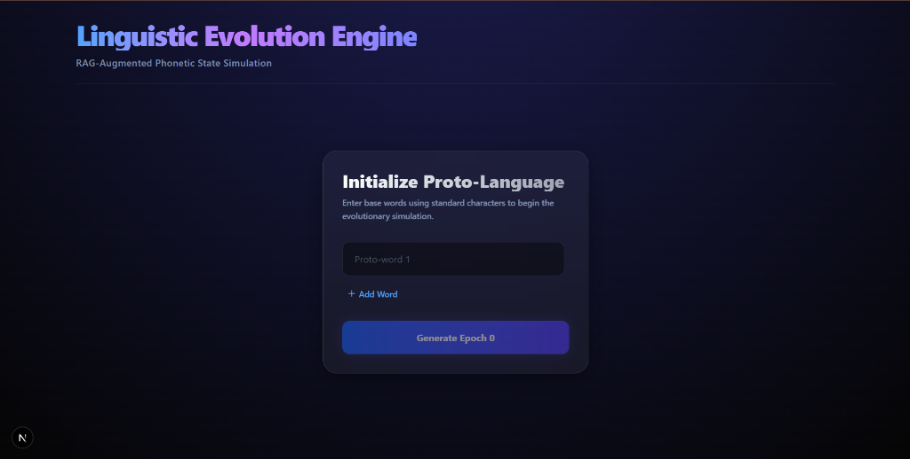
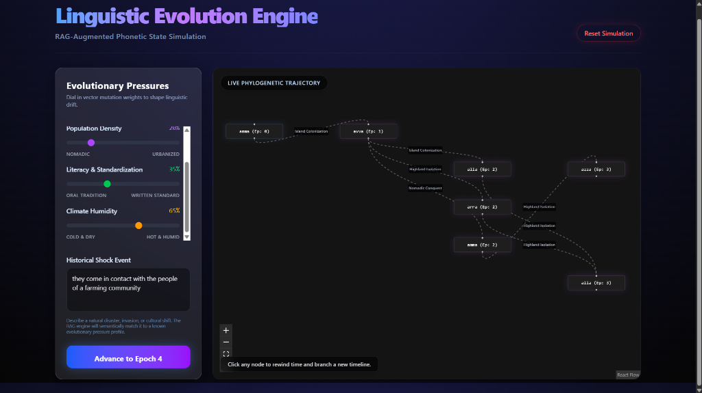

# Linguistic Evolution Engine

**🌐 Live Demo:** [https://linguistics-evolution-engine.vercel.app](https://linguistics-evolution-engine.vercel.app)



A full-stack, RAG-augmented phylogenetic simulation engine that models the phonetic evolution of language over time based on true academic linguistic principles. 

This project bridges the gap between historical linguistics and modern machine learning by treating words not as dictionary definitions, but as geometric coordinates in phonetic space that shift predictably under environmental pressures.

---

## The Technical Concepts, Mapped to Linguistics

### 1. Articulatory Feature Vectors → "How your mouth makes sounds"
**The Linguistics:** Every human speech sound can be described by physical properties of how your mouth produces it (articulatory phonology).
- The sound `"p"` → lips pressed together (bilabial), air stopped then released (plosive), no vocal cord vibration (voiceless).
- The sound `"v"` → teeth on lip (labiodental), continuous airflow (fricative), vocal cords vibrating (voiced).

These aren't abstract categories — they're physical coordinates of your vocal tract.

**The Technical Mapping:** We represent each word as a numeric vector by converting its sounds into these physical properties. 
For example, averaging the phonemes of `"pater"` yields a vector:
`[place_of_articulation: 0.1, manner: 0.4, voicing: 0.0, vowel_height: 0.6, backness: 0.3]`

This is a point in a 5-dimensional space. The word now has a location in geometry. The engine uses libraries like `epitran` to convert text → IPA, then maps IPA symbols to these feature dimensions automatically.

### 2. Vector Arithmetic → "Pressure bends language over time"
**The Linguistics:** Languages don't change randomly. They change in patterned directions driven by real forces:
- **Mountain Isolation:** Communities cut off from neighbors stop borrowing sounds, consonants shift toward the back of the throat (velar sounds like "k", "g") because high-altitude breathing affects articulation.
- **Trade Contact:** Foreign sounds get borrowed, and language simplifies to aid communication between groups.
- **Conquest / Famine:** Stress and urgency patterns shift, vowels shorten, and consonant clusters simplify.

**The Technical Mapping:** Each environmental pressure becomes a vector offset — a direction and magnitude to push the word's position in phonetic space.
`Mountain Isolation vector = [+0.3, 0.0, -0.1, -0.2, +0.2]` (shift toward velar, shorten vowels)

```python
evolved_word_vector = proto_word_vector + pressure_vector
```
This is the core engine's "AI." It's just vector addition. The sophistication lies in the fact that these offsets represent real, documented historical phonological shifts.

### 3. Vector-to-Phoneme Decoding → "Turn the shifted point back into a word"
**The Linguistics:** After the vector shifts under environmental pressure, you arrive at a new coordinate in phonetic space. You need to find the closest real IPA sound to that new coordinate, and assemble those sounds into a pronounceable modern word.

**The Technical Mapping:** The engine uses a Nearest-Neighbor lookup. It holds a table of common IPA phonemes mapped to their feature vectors. After applying the shift, it calculates the Euclidean distance to find the closest phonemes to each shifted dimension, reassembling the word string natively.
`shifted_vector` → `Nearest IPA phoneme lookup` → `new word string "baθer"`

### 4. Neo4j Graph Database → "The evolutionary family tree"
**The Linguistics:** Language evolves on a phylogenetic tree, exactly like species biology. Latin `"pater"` → Old French `"padre"` → French `"père"`. Every word is a descendant of an earlier word, and you can trace the lineage.

**The Technical Mapping:** Neo4j stores this natively.
- **Nodes:** `(word: "pater", epoch: 0) → (word: "baθer", epoch: 1)`
- **Edges:** `MUTATED_BY { event: "mountain_isolation", vector_delta: [...] }`



When clicking a modern word, the engine runs a Cypher traversal query backward through the edges to the root. This allows for seamless "time travel" (branching alternate timelines from historical nodes).

### 5. RAG (Retrieval-Augmented Generation) → "Ground the simulation in real history"
**The Linguistics:** Real linguistic shifts have documented rules. Grimm's Law demonstrates how Proto-Indo-European `"p"` became Germanic `"f"` consistently. The Great Vowel Shift systematically raised all long vowels in English.

**The Technical Mapping:** The system utilizes a Retrieval-Augmented Generation (RAG) architecture powered by Supabase (`pgvector`) and Hugging Face embedding models (`BAAI/bge-small-en-v1.5`). We authored specific historical event profiles as structured JSON containing real-world vectors.
When you describe a historical shock event in the UI (e.g., *"they come in contact with the people of a farming community"*), the RAG engine converts your sentence into a 384-dimensional semantic embedding, performs a vector similarity search in Postgres to find the closest historical analog (e.g., *Island Colonization* or *Trade Contact*), and injects those precise linguistic mutation weights into the current epoch's mathematical calculation.

---

## Stack & Architecture
- **Frontend:** Next.js (React), TailwindCSS, React Flow (for tree visualization), Zustand.
- **Backend:** Python (FastAPI), Pydantic, Epitran.
- **Databases:** Neo4j (AuraDB) for Phylogenetic Tree tracking, Supabase (PostgreSQL + pgvector) for Semantic RAG storage.
- **AI/ML:** Hugging Face Inference API for text-to-vector embeddings.

## Local Setup & Development

1. **Install Dependencies**
   ```bash
   # Backend
   cd backend
   python -m venv venv
   source venv/bin/activate  # On Windows: venv\Scripts\activate
   pip install -r requirements.txt
   
   # Frontend
   cd frontend
   npm install
   ```

2. **Environment Variables**
   Create `.env` inside `backend/` and `frontend/` directories:
   ```env
   # backend/.env
   NEO4J_URI=neo4j+s://...
   NEO4J_USERNAME=...
   NEO4J_PASSWORD=...
   SUPABASE_URL=...
   SUPABASE_KEY=...
   HUGGINGFACE_TOKEN=...
   
   # frontend/.env
   NEXT_PUBLIC_API_URL=http://localhost:8000
   ```

3. **Run the Engines**
   ```bash
   # Terminal 1 (Backend)
   cd backend
   uvicorn main:app --reload
   
   # Terminal 2 (Frontend)
   cd frontend
   npm run dev
   ```
